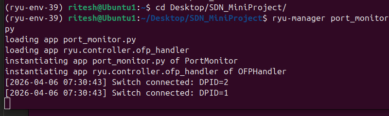
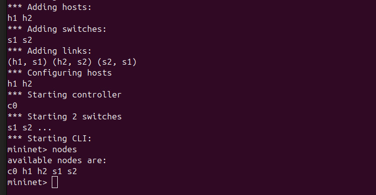
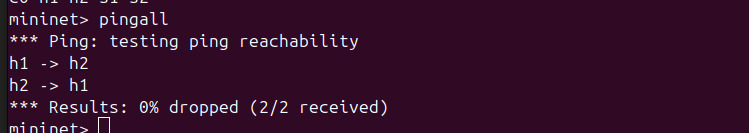
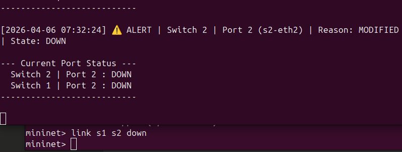
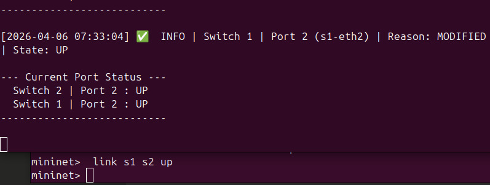
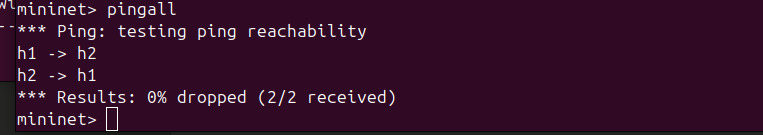

# Port Status Monitoring Tool (SDN - Topic 13)

## Problem Statement
Monitor and log switch port status changes in an SDN network using 
a Ryu OpenFlow controller. Detect port up/down events, generate alerts, 
and display live status.

## Tools Used
- Mininet 2.3.0
- Ryu 4.34 (OpenFlow 1.3)
- Open vSwitch 3.3.4
- Python 3.9

## Topology
- 2 switches (s1, s2) connected linearly
- 2 hosts (h1, h2)
- Remote Ryu controller

## Setup & Execution

### Step 1: Start the Ryu controller
```bash
source ryu-env-39/bin/activate
ryu-manager port_monitor.py
```

### Step 2: Start Mininet (in a new terminal)
```bash
sudo python3 topo.py
```

## Controller Started:

## Nodes Command:

## Net Command:

## pingall Command:

## link s1 s2 down:

## link s1 s2 up:

## Final pingall:

